# FIAP - Faculdade de Informática e Administração Paulista

<p align="center">
<a href= "https://www.fiap.com.br/"></a>
</p>

<br>

# Projeto: fiap_sprint4_reply

## Atividade em Grupo: FIAP - 1TIAOB - 2025/1 - Fase6 Sprint 4 - Reply

## 👨‍🎓 Integrantes: 
- <a href="">Alice C. M. Assis - RM 566233</a>
- <a href="">Leonardo S. Souza - RM 563928</a>
- <a href="">Lucas B. Francelino - RM 561409</a>
- <a href="">Pedro L. T. Silva - RM 561644</a>
- <a href="">Vitor A. Bezerra - RM 563001</a>

## 👩‍🏫 Professores:
### Tutor(a) 
- <a href="proflucas.moreira@fiap.com.br">Lucas Gomes Moreira</a>
### Coordenador(a)
- <a href="profandre.chiovato@fiap.com.br">André Godoi Chiovato</a>
- 
****

# 1. Vídeo e deploy do projeto na nuvem:

INSERIR VIDEO AQUI

- Link do vídeo: LINK AQUI

Sobre o deploy na nuvem, o grupo realizou o deploy do projeto no ambiente "AWS Academy". No entanto, este ambiente fica disponível no período de apenas 4 horas, sendo encerrado automaticamente após este período.
Assim, caso queiram o link do projeto rodando na nuvem, pedimos a gentileza de entrar em contato com o grupo para que possamos iniciar o ambiente e disponibilizar o link do dashboard, conforme print abaixo:

<p align="center">
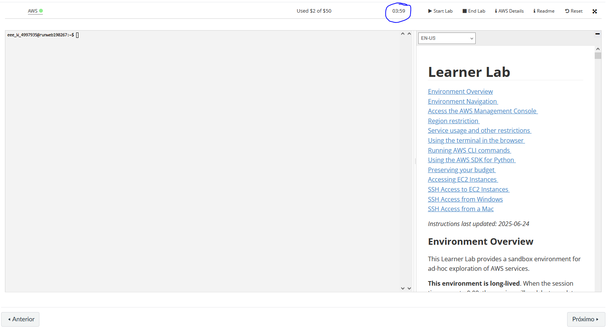
</p>

Não obstante, tendo visto esta limitação, o grupo adicionou neste Readme o passo a passo de como fazer o deploy de todo o projeto facilmente na nuvem utilizando Terraform e AWS CLI, conforme explicado na seção "Deploy na Nuvem AWS com Terraform".

Posto isto, também é possível fazer o deploy do projeto na sua própria conta AWS, bastando seguir as instruções da seção "Deploy na Nuvem AWS com Terraform".

# 2. Descrição e Objetivos

Esta entrega tem como objetivo principal integrar todos os componentes desenvolvidos nas Entregas 1, 2 e 3 em um pipeline funcional, capaz de simular ou executar o fluxo completo de dados, desde a coleta até a visualização e geração de alertas. O pipeline deve contemplar:

- Coleta/ingestão de dados a partir do ESP32 (real ou simulado via Wokwi/VSCode/PlatformIO), com pelo menos um sensor ativo, gerando leituras variáveis.
- Persistência dos dados coletados em um banco de dados relacional, conforme o modelo lógico (DER) e as tabelas definidas anteriormente.
- Treinamento e/ou inferência de um modelo básico de Machine Learning utilizando os dados armazenados, com apresentação de ao menos uma métrica relevante (ex: acurácia, MAE) e uma visualização pertinente (ex: curva de previsão, matriz de confusão).
- Visualização dos resultados em um dashboard ou relatório, exibindo KPIs do processo (ex: média/variação do sensor, score do modelo, número de alertas) e implementação de alertas simples baseados em thresholds ou regras definidas.

---

## 📌 Resumo do Fluxo do Projeto

1. **Coleta de Dados:** ESP32 (real ou simulado) lê sensores e envia dados via HTTP para a API.
2. **Ingestão:** API FastAPI recebe e armazena os dados no banco relacional.
3. **Persistência:** Dados salvos em PostgreSQL conforme DER definido.
4. **Machine Learning:** Treinamento/inferência de modelos com PyCaret usando dados do banco.
5. **Visualização:** Dashboard Streamlit exibe KPIs, gráficos e alertas em tempo real.
6. **Notificações:** Alertas automáticos por e-mail via AWS SNS quando houver previsão do Machine Learing.

---

## 🔗 Entregas Anteriores e Integração

| Fase/Entrega | Repositório/Link | Descrição/Integração                                                                                   |
|--------------|------------------|--------------------------------------------------------------------------------------------------------|
| Sprint 1     | [Sprint 1](https://github.com/Hinten/fiap_sprint1_reply) | Planejamento da arquitetura inicial e definição dos blocos do pipeline.                                |
| Sprint 2     | [Sprint 2](https://github.com/Hinten/fiap_sprint2_reply) | Simulação do circuito ESP32 e sensores, envio de dados para API local e modelagem do banco relacional. |
| Sprint 3     | [Sprint 3](https://github.com/Lesasouza/fiap_sprint3_reply) | Primeiros experimentos de ML.                                                                          |
| Sprint 4     | (Este repositório) | Integração completa: coleta, ingestão, persistência, ML, dashboard e alertas.                          |

> **Como as entregas se conectam:**  
> Cada fase evoluiu o projeto, partindo do planejamento (Sprint 1), passando pela simulação e ingestão de dados (Sprint 2), treinamento de IA (Sprint 3), até a integração total e observabilidade (Sprint 4). O pipeline final costura todos os componentes, garantindo reprodutibilidade e rastreabilidade.

---

# 3. Justificativa dos Sensores Escolhidos

- **Sensor de Temperatura (MPU6050):** Permite monitorar o aquecimento de equipamentos, prevenindo falhas por superaquecimento.
- **Sensor de Vibração (MPU6050):** Essencial para identificar padrões anormais que podem indicar desgaste ou mau funcionamento de máquinas.
- **Sensor de Luminosidade (LDR):** Útil para monitorar ambientes industriais onde a iluminação pode impactar processos ou segurança.

Esses sensores foram escolhidos por serem amplamente utilizados em ambientes industriais e facilmente simuláveis no Wokwi.

# 4. Esquema do Circuito Simulado

O circuito simulado é o mesmo feito quando da entrega 2 (https://github.com/Hinten/fiap_sprint2_reply), foram feitas pequenas modificações, principalmente na conexão WIFI e variáveis de ambiente, para que o ESP32 consiga se conectar a API local e enviar os dados dos sensores.

<p align="center">
  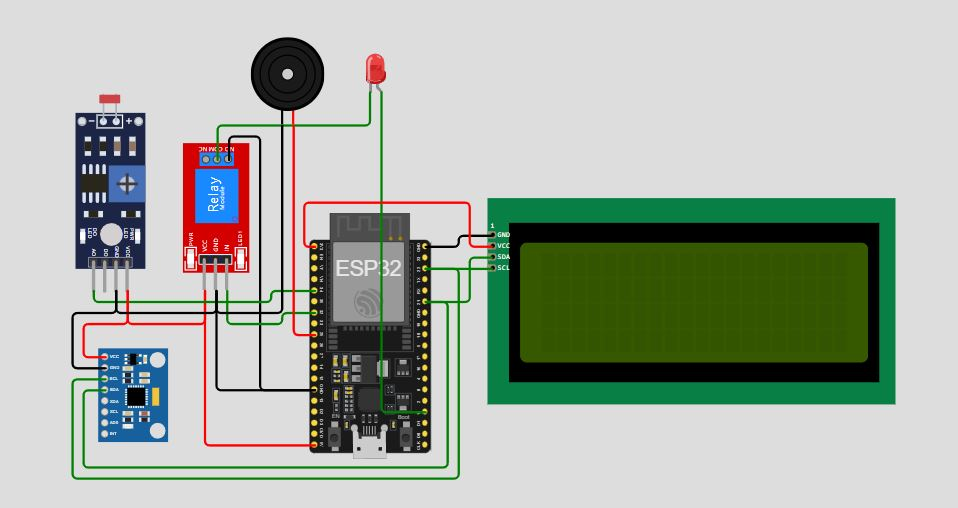
</p>

- O ESP32 está conectado ao sensor MPU6050 (I2C) e ao LDR (analógico).
- LED, relé e buzzer são usados para alertas visuais e sonoros.
- O LCD exibe informações em tempo real sobre os sensores.

## Conexão com o Wi-Fi e envio de dados para a API

Para que a simulação funcione corretamente, é necessário configurar a conexão com o Wi-Fi simulado do Wokwi e definir o IP do servidor local da API.

Assim, é necessário alterar o arquivo [.env](src/wokwi/.env) do Wokwi e setar a variável 'API_URL' para 'http://**IP DE SUA MÁQUINA NA REDE LOCAL**:8180', conforme exemplo abaixo:

```plaintext
API_URL=http://192.168.0.1:8180
```

> NOTA1: Não sete o IP da API para localhost ou 127.0.0.1, pois o ESP32 não conseguirá se conectar a ele. O localhost do ESP32 é o próprio ESP32, e não a máquina onde o servidor está rodando.

> NOTA2: Caso você esteja rodando a simulação e mesmo assim o ESP32 não consiga se conectar à API, verifique se o firewall da sua máquina está bloqueando a porta 8180. Se estiver, libere a porta para que o ESP32 consiga se conectar.

> NOTA3: Caso você faça o deploy do projeto na nuvem AWS (conforme explicado abaixo), o script irá atualizar automaticamente a variável API_URL para o ip da api na nuvem, não sendo necessária nenhuma ação pelo usuário.

Após configurado o arquivo [.env](src/wokwi/.env), você poderá iniciar a simulação do ESP32 no Wokwi. O circuito irá coletar os dados dos sensores e enviá-los para a API, que por sua vez irá armazenar os dados no banco de dados.

## Registro do Funcionamento da Simulação

As leituras dos sensores são coletadas pelo ESP32 e enviadas automaticamente para a API via requisições HTTP. O envio ocorre a cada ciclo de leitura, garantindo que os dados estejam sempre atualizados no banco de dados para análise posterior. O monitor serial e o display LCD exibem em tempo real as leituras e alertas, enquanto a API armazena cada registro recebido.

- **Print do Monitor Serial:**

<p align="center">
  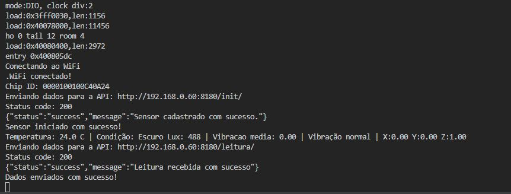
</p>

- **Print do LCD:**

<p align="center">
  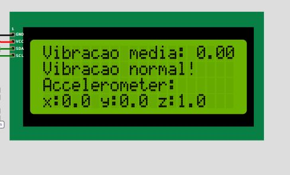
</p>


# 5. API para salvar os dados do sensor

Neste projeto, foi implementada uma API básica utilizando o FastAPI para receber os dados do sensor e armazená-los no banco de dados. A API permite que o ESP32 envie as leituras dos sensores, que são então salvas no banco de dados para posterior análise e visualização.

A API pode ser executada separadamente executando o arquivo [api_basica.py](src/api/api_basica.py).

Explicações mais detalhadas sobre como iniciar a api serão apresentadas na seção "Instalando e Executando o Projeto", a seguir neste mesmo README.md.

# 6. Armazenamento de Dados em Banco SQL com Python

<p align="center">
  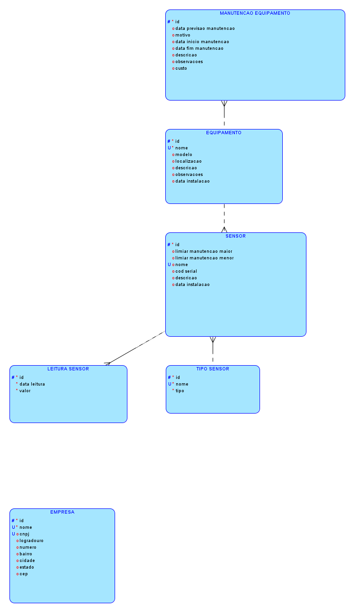
</p>


<p align="center">
  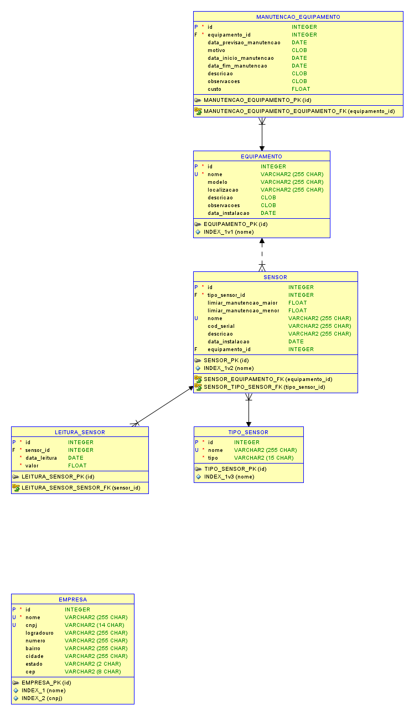
</p>

Modelo de Entidade-Relacionamento:

Tabela: MANUTENCAO_EQUIPAMENTO
  - id (INTEGER NOT NULL) [PK]
  - equipamento_id (INTEGER NOT NULL) [FK -> EQUIPAMENTO]
  - data_previsao_manutencao (DATETIME)
  - motivo (TEXT)
  - data_inicio_manutencao (DATETIME)
  - data_fim_manutencao (DATETIME)
  - descricao (TEXT)
  - observacoes (TEXT)
  - custo (FLOAT)

Tabela: EQUIPAMENTO
  - id (INTEGER NOT NULL) [PK]
  - nome (VARCHAR(255) NOT NULL)
  - modelo (VARCHAR(255))
  - localizacao (VARCHAR(255))
  - descricao (TEXT)
  - observacoes (TEXT)
  - data_instalacao (DATETIME)

Tabela: TIPO_SENSOR
  - id (INTEGER NOT NULL) [PK]
  - nome (VARCHAR(255) NOT NULL)
  - tipo (VARCHAR(15) NOT NULL)

Tabela: SENSOR
  - id (INTEGER NOT NULL) [PK]
  - tipo_sensor_id (INTEGER NOT NULL) [FK -> TIPO_SENSOR]
  - limiar_manutencao_maior (FLOAT)
  - limiar_manutencao_menor (FLOAT)
  - nome (VARCHAR(255))
  - cod_serial (VARCHAR(255))
  - descricao (VARCHAR(255))
  - data_instalacao (DATETIME)
  - equipamento_id (INTEGER) [FK -> EQUIPAMENTO]

Tabela: LEITURA_SENSOR
  - id (INTEGER NOT NULL) [PK]
  - sensor_id (INTEGER NOT NULL) [FK -> SENSOR]
  - data_leitura (DATETIME NOT NULL)
  - valor (FLOAT NOT NULL)

Tabela: EMPRESA
  - id (INTEGER NOT NULL) [PK]
  - nome (VARCHAR(255) NOT NULL)
  - cnpj (VARCHAR(14))
  - logradouro (VARCHAR(255))
  - numero (VARCHAR(255))
  - bairro (VARCHAR(255))
  - cidade (VARCHAR(255))
  - estado (VARCHAR(2))
  - cep (VARCHAR(8))

A modelagem do banco de dados foi pensada para garantir a rastreabilidade, integridade e flexibilidade do sistema de monitoramento de sensores e equipamentos. Abaixo, explico o motivo da inclusão de cada entidade e campo:

**Tabela: EMPRESA**
***Permite registrar informações das empresas responsáveis pelos equipamentos monitorados, facilitando a gestão multiempresa.***
- **id**: Identificador único da empresa, fundamental para relacionamentos e integridade dos dados.
- **nome**: Permite identificar a empresa de forma única no sistema.
- **cnpj**: Cadastro Nacional da Pessoa Jurídica, essencial para validação e identificação fiscal.
- **logradouro, numero, bairro, cidade, estado, cep**: Campos necessários para armazenar o endereço completo da empresa, facilitando localização e contato.

**Tabela: EQUIPAMENTO**
***Representa cada máquina ou dispositivo monitorado, permitindo associar sensores e manutenções.***
- **id**: Identificador único do equipamento, necessário para relacionamentos e controle individual.
- **nome**: Nome do equipamento, facilita a identificação e evita duplicidade.
- **modelo**: Permite diferenciar equipamentos do mesmo tipo, mas de modelos distintos.
- **localizacao**: Indica onde o equipamento está instalado, importante para manutenção e monitoramento.
- **descricao**: Campo para detalhar características específicas do equipamento.
- **observacoes**: Espaço para anotações gerais, como histórico de uso ou particularidades.
- **data_instalacao**: Registra quando o equipamento foi instalado, útil para controle de manutenção preventiva.

**Tabela: TIPO_SENSOR**
***Define os tipos de sensores disponíveis (ex: temperatura, vibração), facilitando a categorização e expansão futura.***
- **id**: Identificador único do tipo de sensor.
- **nome**: Nome do tipo de sensor, garante unicidade e facilita buscas.
- **tipo**: Especifica a categoria do sensor (ex: temperatura, umidade), importante para validação e processamento dos dados.

**Tabela: SENSOR**
***Representa cada sensor físico instalado, permitindo rastrear leituras e manutenções.***
- **id**: Identificador único do sensor.
- **tipo_sensor_id**: Relaciona o sensor ao seu tipo, garantindo integridade e padronização.
- **limiar_manutencao_maior**: Define o valor máximo aceitável para o sensor, acionando alertas quando ultrapassado.
- **limiar_manutencao_menor**: Define o valor mínimo aceitável para o sensor, acionando alertas quando ultrapassado.
- **nome**: Nome do sensor, facilita a identificação.
- **cod_serial**: Código serial do sensor, importante para rastreabilidade física.
- **descricao**: Detalhes adicionais sobre o sensor.
- **data_instalacao**: Data de instalação do sensor, relevante para manutenção e histórico.
- **equipamento_id**: Relaciona o sensor ao equipamento onde está instalado, permitindo rastrear medições por equipamento.

**Tabela: LEITURA_SENSOR**
***Armazena cada leitura realizada pelos sensores, base para análises e alertas.***
- **id**: Identificador único da leitura.
- **sensor_id**: Relaciona a leitura ao sensor correspondente, garantindo rastreabilidade.
- **data_leitura**: Data e hora da leitura, essencial para análises temporais.
- **valor**: Valor capturado pelo sensor, principal dado para monitoramento e análise.
- 
**Tabela: MANUTENCAO_EQUIPAMENTO**
***ermite registrar manutenções preventivas e corretivas dos equipamentos, integrando histórico operacional.***
- **id**: Identificador único da manutenção.
- **equipamento_id**: Relaciona a manutenção ao equipamento.
- **data_previsao_manutencao**: Data prevista para manutenção.
- **motivo**: Motivo da manutenção.
- **data_inicio_manutencao, data_fim_manutencao**: Período da manutenção.
- **descricao, observacoes**: Detalhes e anotações sobre a manutenção.
- **custo**: Valor gasto na manutenção.

Cada entidade e campo foi incluído para garantir a integridade dos dados, facilitar consultas e permitir a expansão futura do sistema, como integração com novos tipos de sensores, equipamentos ou empresas.

## Models e Python

Para realizar a conversão das linhas e colunas da database para Python, foram definidas classes as quais são responsáveis por fazer as operações CRUD e demais funcionalidades do banco de dados.
Essas classes podem ser encontradas na pasta `src/database/models`, e todas elas herdam a classe principal chamada [Model](src/database/tipos_base/model.py).

## Script de Criação do Banco de Dados

O script para criação do banco de dados e tabelas pode ser encontrado no arquivo [assets/table_creation.ddl](assets/table_creation.ddl).
**Este script não precisa ser executado manualmente, pois o banco de dados é criado automaticamente ao iniciar o dashboard ou API.**

# 8. Instalando e Executando o Projeto

O sistema foi desenvolvido em Python e utiliza um banco de dados SQLite para armazenar os dados. O código é modularizado, permitindo fácil manutenção e expansão.

## 📦 Requisitos
- *Python 3.11.9*

## 📂 Instalação

- Instale as dependências utilizando o arquivo requirements.txt:
    ```bash
    pip install -r requirements.txt
    ```

- Para iniciar o dashboard interativo, execute o seguinte comando no terminal:
    ```bash
    streamlit run main_dash.py
    ```

- Para iniciar a api, execute o seguinte comando no terminal:
    ```bash
    uvicorn src.api.api_basica:app --host 0.0.0.0 --port 8180
    ```

## Arquivo de Configuração

O projeto utiliza um arquivo especial denominado **`.env`** para armazenar variáveis de ambiente sensíveis, como credenciais de banco de dados e chaves de APIs externas. Por razões de segurança, esse arquivo **não deve ser compartilhado publicamente**.

### 📄 O que é o `.env`?

O `.env` é um arquivo-texto simples, onde cada linha define uma variável de ambiente no formato `NOME_VARIAVEL=valor`. Esse método permite separar informações confidenciais do código-fonte, facilitando a configuração do sistema para diferentes ambientes (desenvolvimento, testes, produção, etc).

### 🔑 Variáveis Utilizadas

O projeto utiliza variáveis de ambiente para configuração dos serviços, bancos de dados e integrações. Abaixo estão as principais variáveis utilizadas:

**Variáveis Gerais:**
- `LOGGING_ENABLED`: Ativa/desativa logs detalhados (`true` ou `false`).
- `ENABLE_API`: Ativa/desativa a API (`true` ou `false`).
- `ORACLE_DB_FROM_ENV`: Usa variáveis de ambiente para conexão Oracle (`true` ou `false`).
- `SQL_LITE`: Usa SQLite como banco de dados (`true` ou `false`).

**Variáveis do PostgreSQL:**
- `POSTGRE_DB_FROM_ENV`: Usa variáveis de ambiente para conexão PostgreSQL (`true` ou `false`).
- `POSTGRE_USER`: Usuário do banco PostgreSQL.
- `POSTGRE_PASSWORD`: Senha do banco PostgreSQL.
- `POSTGRE_DB`: Nome do banco PostgreSQL.
- `POSTGRE_HOST`: Host do banco PostgreSQL.
- `POSTGRE_PORT`: Porta do banco PostgreSQL.

**Variáveis AWS/SNS:**
- `AWS_ACCESS_KEY_ID`: Chave de acesso AWS.
- `AWS_SECRET_ACCESS_KEY`: Chave secreta AWS.
- `AWS_SESSION_TOKEN`: Token de sessão AWS (opcional).
- `SNS_TOPIC_ARN`: ARN do tópico SNS para notificações.
- `SNS_REGION`: Região AWS do SNS.

**Portas dos Serviços:**
- `DASHBOARD_PORT`: Porta exposta para o dashboard (padrão: 8501).
- `API_PORT`: Porta exposta para a API (padrão: 8180).

**Variável de Simulação Wokwi:**
- `API_URL`: URL da API para envio dos dados do ESP32 (exemplo: `http://192.168.0.60:8180`).

# 9. Deploy na Nuvem AWS com Terraform

Para facilitar o deploy e os testes do sistema, foi adotada uma abordagem automatizada utilizando Terraform e AWS CLI para provisionamento da infraestrutura na nuvem AWS.

## Diagrama da Arquitetura

<p align="center">
  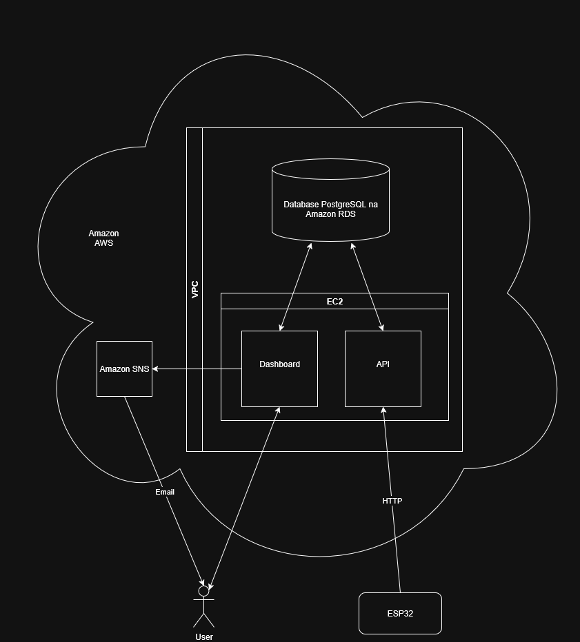
</p>

Comparado com o primeiro planejamento, que pode ser visto no github https://github.com/Hinten/fiap_sprint1_reply, o projeto vem evoluindo bem, estando quase todo o planejamento inicial implementado, faltando apenas pequenos apontamentos e otimizações.

## Pré-requisitos

- **Terraform** instalado na máquina local ([documentação oficial](https://developer.hashicorp.com/terraform/tutorials/aws-get-started/install-cli)).
- **AWS CLI** instalado ([documentação oficial](https://docs.aws.amazon.com/cli/latest/userguide/getting-started-install.html)).
- **Credenciais da AWS CLI configuradas** (comando `aws configure`), utilizando uma conta AWS válida.

## Observação sobre Custos

> **Atenção:** O deploy da infraestrutura na AWS gera um pequeno custo de centavos de dólar por dia, principalmente devido à criação da VPC (Virtual Private Cloud) e recursos associados. Recomenda-se destruir a infraestrutura após os testes para evitar cobranças desnecessárias.

## Como realizar o deploy

1. Acesse a pasta `iac/dev` do projeto.
2. Execute os comandos do Terraform para inicializar e aplicar a infraestrutura:

```cmd
cd iac\dev
terraform init
terraform apply
```

3. Confirme a aplicação quando solicitado. O Terraform irá provisionar toda a infraestrutura necessária na AWS.

4. Para destruir a infraestrutura e evitar custos:

```cmd
terraform destroy
```

## Executando o deploy da aplicação no servidor

Após a criação da infraestrutura, é necessário rodar o script `deploy_app_server.bat` na raiz do projeto. Esse script automatiza o processo de:
- Obter o IP público da instância criada pelo Terraform.
- Copiar os arquivos necessários (código, Dockerfiles, docker-compose, variáveis de ambiente) para o servidor EC2 via SSH/SCP.
- Instalar Docker, Docker Compose e Git na máquina remota.
- Clonar o repositório do projeto na máquina EC2.
- Corrigir permissões e preparar o ambiente.

> **Por que usar esse script?**
>
> O build da imagem Docker diretamente na nuvem é mais rápido para testes, pois a imagem local pode ser muito grande (ex: 1.6GB devido ao PyCaret). Embora não seja a abordagem ideal para produção, agiliza o deploy e os testes durante o desenvolvimento.

Após rodar o script, o ambiente estará pronto, sendo printados no terminal as urls do dashboard e da api.

## Justificativa da abordagem

Esta estratégia foi adotada para agilizar o deploy e os testes do sistema durante o desenvolvimento, permitindo rápida criação e remoção do ambiente de nuvem.

No futuro, iremos aprimorar o processo, realizando o build da imagem Docker localmente e enviando-a para um repositório (como Amazon ECR ou Docker Hub), ou ainda adotando um pipeline de CI/CD para automação completa do deploy, garantindo maior controle, segurança e escalabilidade.

# 10. Treinamento do modelo de Machine Learning

Comparado ao trabalho anterior, constante no github https://github.com/Lesasouza/fiap_sprint3_reply, foi elaborada uma nova View de treinamento de modelos de Machine Learning no dashboard utilizando o Pycaret.

<p align="center">
  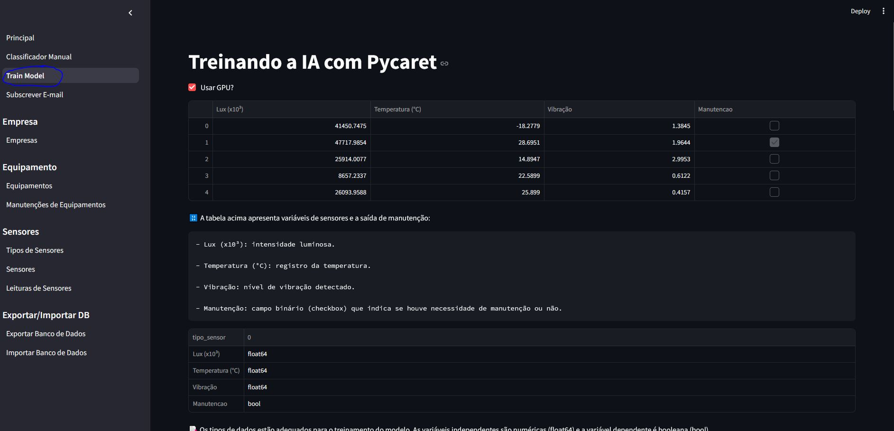
</p>

Essa nova View permite que o usuário treine vários modelos diferentes de Machine Learning com apenas um clique, utilizando a biblioteca PyCaret para simplificar o processo.

<p align="center">
  
</p>

O user pode selecionar a métrica que deseja otimizar (ex: Acurácia, F1-Score, ROC AUC) e o sistema treina automaticamente vários modelos, apresentando os resultados em uma tabela interativa, mostrando visualizações pertinentes, como a matriz de confusão e posteriormente salva o melhor modelo.

<p align="center">
  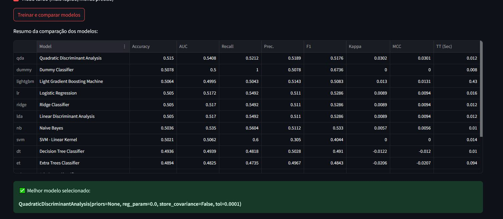
</p>

<p align="center">
  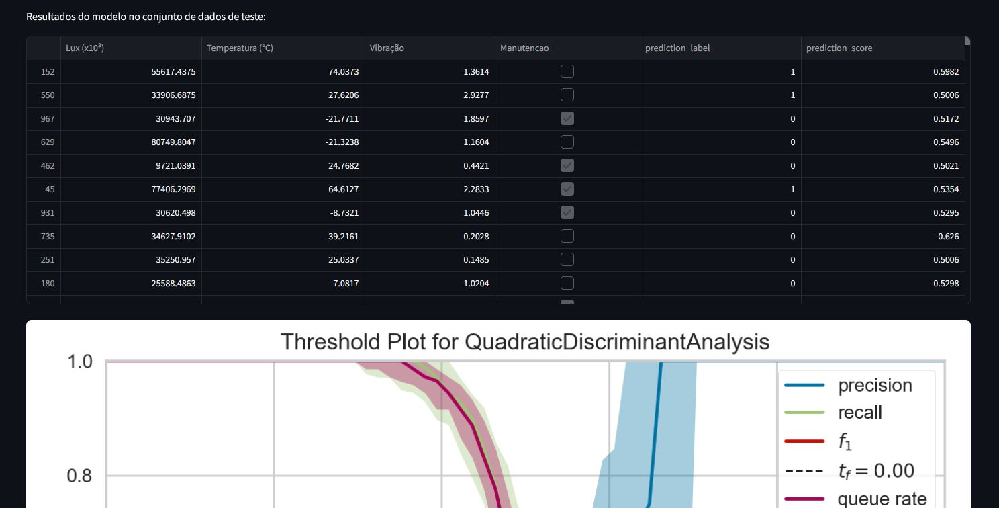
</p>

<p align="center">
  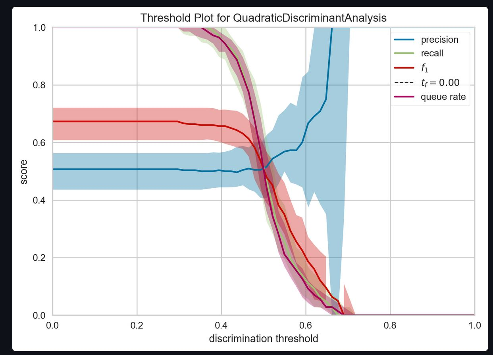
</p>

<p align="center">
  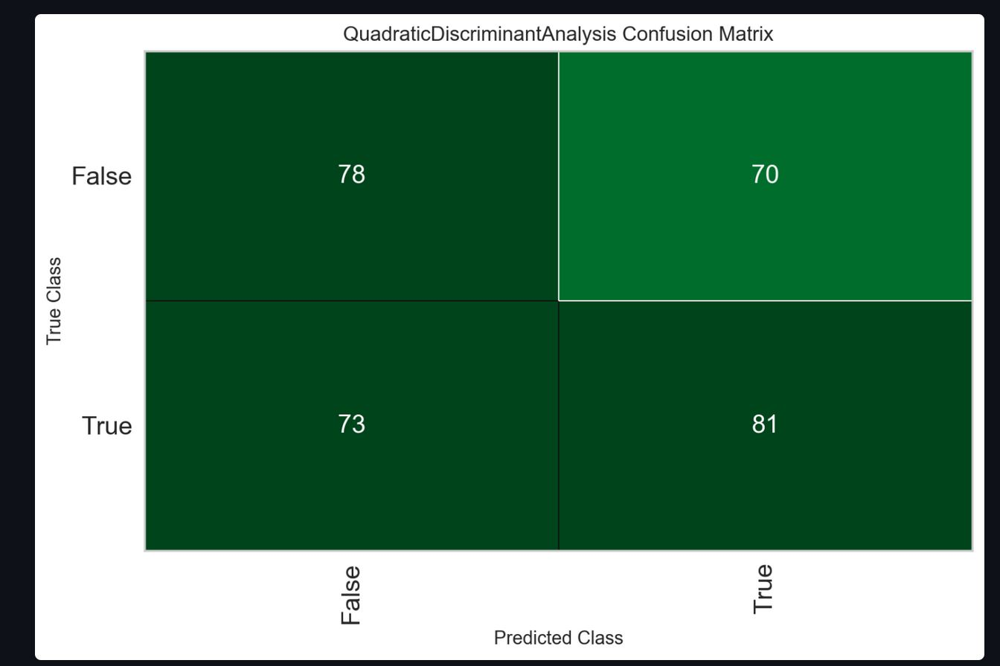
</p>

<p align="center">
  
</p>

# 11. 📊 Notificações via EMAIL

O sistema implementa notificações automáticas via email utilizando o serviço Amazon SNS (Simple Notification Service) da AWS. Para que o user receba as notificações, é necessário configurar o serviço SNS na AWS e adicionar o email do destinatário como assinante do tópico SNS.

<p align="center">
  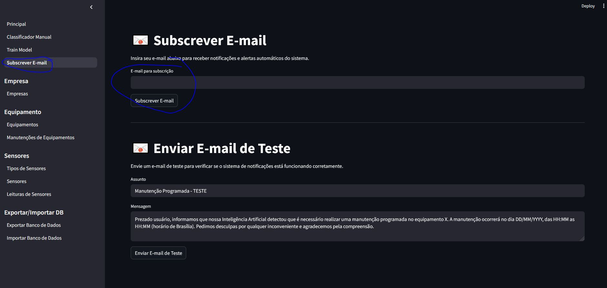
</p>

Após a adicionar o email, o usuário receberá um email de confirmação, sendo necessário clicar no link para confirmar a subscrição.

<p align="center">
  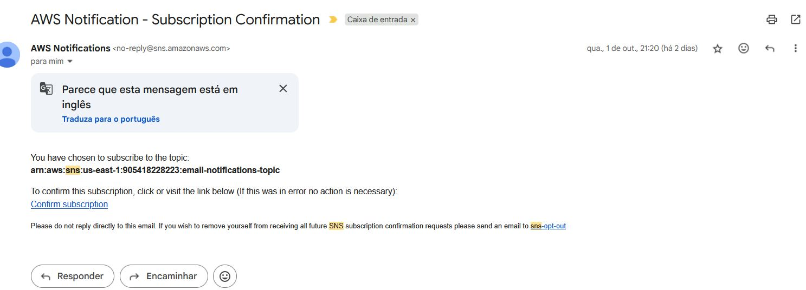
</p>

Confirmada a subscrição, o usuário começará a receber as notificações enviadas pelo sistema. Para ter certeza que o email está funcionando, o usuário pode enviar um email de teste clicando no botão "Enviar E-mail de Teste".

# 12. 📊 Visualização de leituras em tempo real e notificação de alertas

A página principal do aplicativo se tornou uma View para visualização das leituras dos sensores em tempo real, com gráficos atualizados a cada 60 segundos.

> Nota: Tentamos implementar atualizações em um período de tempo menor, mas aparentemente o Streamlit tem um memoryleak que acaba congelando a máquina. Estamos trabalhando para solucionar esse problema nas próximas entregas.
 
<p align="center">
  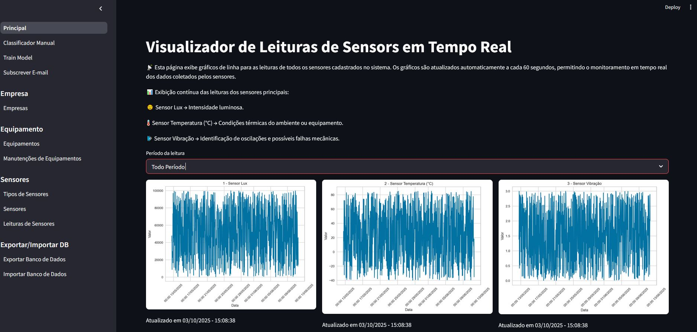
</p>

Caso o user cadastre um sensor com limiares de alerta, nos campos "Limiar De Manutenção Maior" ou "Limiar De Manutenção Menor" o gráfico de visualização mostrará linhas as quais apontam que as leituras estão ultrapassando os limiares, conforme abaixo:.
 
<p align="center">
  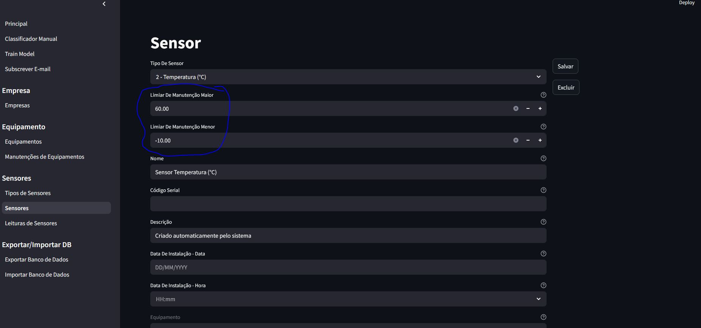
</p>
 
<p align="center">
  
</p>

Por fim, nesta página, o user poderá fazer previsões com os valores das leituras em tempo real, clicando no botão "Fazer Previsão", caso o modelo identifique que a manutenção é necessária, o user poderá enviar um email de alerta clicando no botão "Enviar Alerta de Manutenção".
 
<p align="center">
  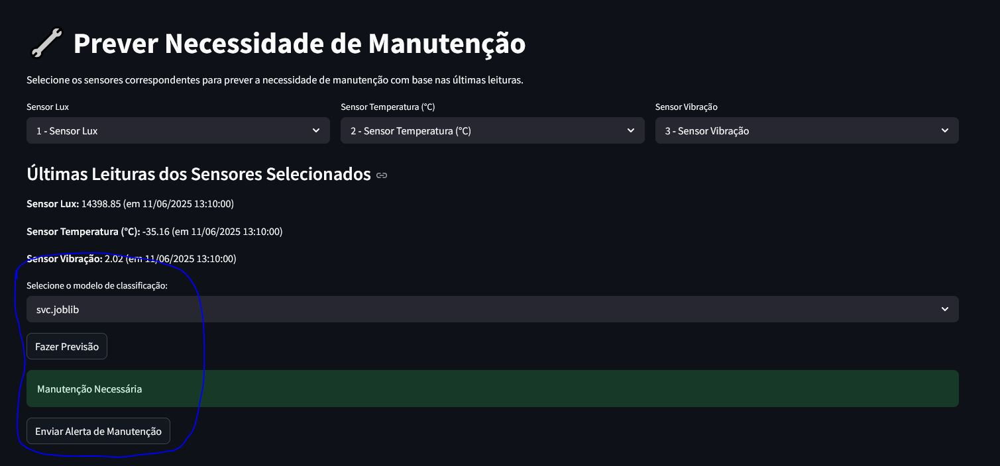
</p>

# 13. Previsão Manual com Modelos Treinados

Também é possível realizar previsões manuais utilizando modelos de machine learning previamente treinados e salvos em arquivos .joblib, conforme demonstrado na imagem abaixo:

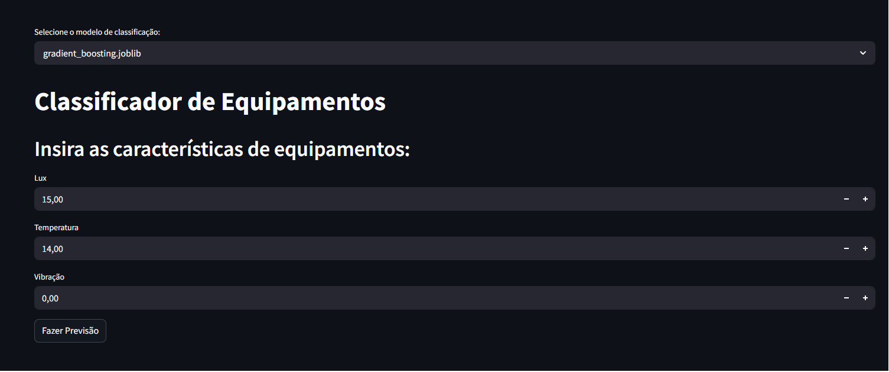

🤖 Classificador de Equipamentos

Este módulo fornece uma interface em Streamlit para carregar modelos de machine learning previamente treinados (arquivos .joblib) e realizar previsões manuais com base em características inseridas pelo usuário.

🚀 Funcionalidades

✅ Carregamento dinâmico de modelos de classificação salvos em .joblib.

✅ Interface simples para entrada de dados (Lux, Temperatura, Vibração).

✅ Previsão com retorno textual:

"Manutenção Necessária"

"Sem Manutenção Necessária"

✅ Seleção do modelo desejado através de um menu interativo.

📊 Exemplo de Uso
Entrada:

Lux = 15

Temperatura = 14

Vibração = 0

Saída:

✅ Sem Manutenção Necessária
(ou)

⚠️ Manutenção Necessária


# 14. Importando a Base de dados utilizada pelo Grupo

As tabelas com os dados utilizados no sistema podem ser encontradas na pasta em [assets/database_export.zip](assets/database_export.zip).

O Grupo disponibilizou uma base de dados inicial para facilitar o uso do sistema. Para importar essa base de dados, siga os passos abaixo:

1. O usuário deve selecionar a opção "Importar Banco de Dados" no menu principal.
<p align="center">
  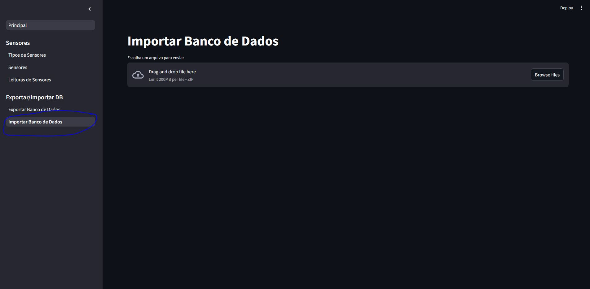
</p>

2. Selecione o arquivo ZIP localizado em [assets/database_export.zip](assets/database_export.zip), espere carregar, role a página até o final e clique no botão "Salvar no Banco de Dados".
<p align="center">
  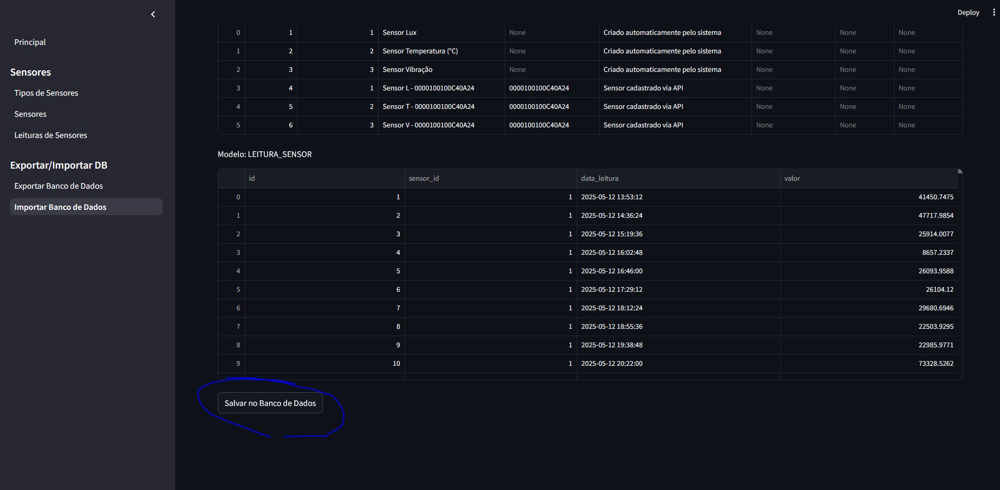
</p>

3. Não feche a janela e espere a operação ser concluída. Após a conclusão, o sistema irá exibir uma mensagem de sucesso. Caso ocorra algum erro, tente novamente.

<p align="center">
  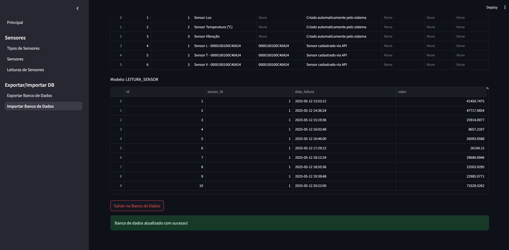
</p>


## 📁 Estrutura de pastas

Dentre os arquivos e pastas presentes na raiz do projeto, definem-se:

- <b>.streamlit</b>: Pasta que contém arquivos de configuração do Streamlit, como o tema da interface e a organização da barra lateral.
- <b>assets</b>: Diretório destinado ao armazenamento de elementos não estruturados do projeto, como imagens e ícones utilizados no dashboard.
- <b>iac</b>: Pasta que contém os arquivos de infraestrutura como código (IaC) desenvolvidos em Terraform, utilizados para provisionar e gerenciar a infraestrutura necessária para o funcionamento do sistema na nuvem.
- <b>src</b>: Diretório principal que contém todo o código-fonte desenvolvido ao longo das fases do projeto. Ele está organizado nos seguintes submódulos:
  - <b>dashboard</b>: Código responsável pela construção do dashboard, desenvolvido em Python com uso da biblioteca Streamlit. ([dashboard](src/dashboard/))
  - <b>database</b>: Módulo responsável pelas operações de banco de dados, incluindo conexões, inserções, listagens, edições e exclusões de registros.
  - <b>logger</b>: Código responsável por registrar (logar) todas as operações executadas no sistema, garantindo rastreabilidade.
  - <b>machine_learning</b>: Contém o código e notebooks relacionados ao desenvolvimento e treinamento dos modelos de Machine Learning.
  - <b>plots</b>: Contém o código responsável pela geração de gráficos e visualizações, utilizado para exibir dados de forma clara e intuitiva no dashboard.
  - <b>wokwi</b>: Contém o código do sensor ESP32 utilizado na simulação de sensores.
  - <b>wokwi_api</b>: Contém o código responsável por criar a API que vai salvar as leituras dos sensores no banco de dados.
- <b>.dockerignore</b>: Arquivo que especifica quais arquivos e pastas devem ser ignorados pelo Docker ao construir a imagem do container, ajudando a reduzir o tamanho da imagem e evitar a inclusão de arquivos desnecessários.
- <b>.env</b>: Arquivo de configuração que contém as chaves de API e outras variáveis de ambiente necessárias para o funcionamento do sistema. É necessário criar este arquivo na raiz do projeto, conforme orientações na seção "Arquivo de Configuração".
- <b>.gitignore</b>: Arquivo que especifica quais arquivos e pastas devem ser ignorados pelo Git, evitando que informações sensíveis ou desnecessárias sejam versionadas. É importante garantir que o arquivo `.env` esteja incluído neste arquivo para evitar o upload de chaves de API e outras informações sensíveis.
- <b>deploy_app_server.bat</b>: Script em batch que automatiza o processo de deploy da aplicação no servidor EC2 na AWS, incluindo a cópia dos arquivos necessários e a configuração do ambiente.
- <b>Dockerfile</b>: Arquivo que define a imagem Docker para o projeto e suas dependências, permitindo a criação de containers consistentes para execução do sistema.
- <b>docker-compose.yml</b>: Arquivo de configuração do Docker Compose que define os serviços, redes e volumes necessários para executar o sistema em containers Docker.
- <b>README</b>: Arquivo de documentação do projeto (este que está sendo lido), com orientações gerais, instruções de uso e contextualização.
- <b>main_dash</b>: Arquivo principal para a execução do dashboard. Está localizado na raiz do projeto com o objetivo de evitar problemas com importações de módulos internos.
- <b>requirements.txt</b>: Arquivo que lista todas as dependências do projeto, necessário para a instalação do ambiente virtual. Deve ser utilizado com o comando `pip install -r requirements.txt` para instalar as bibliotecas necessárias.

## 📋 Licença

<p xmlns:cc="http://creativecommons.org/ns#" xmlns:dct="http://purl.org/dc/terms/"><a property="dct:title" rel="cc:attributionURL" href="https://github.com/agodoi/template">MODELO GIT FIAP</a> por <a rel="cc:attributionURL dct:creator" property="cc:attributionName" href="https://fiap.com.br">Fiap</a> está licenciado sobre <a href="http://creativecommons.org/licenses/by/4.0/?ref=chooser-v1" target="_blank" rel="license noopener noreferrer" style="display:inline-block;">Attribution 4.0 International</a>.</p>
